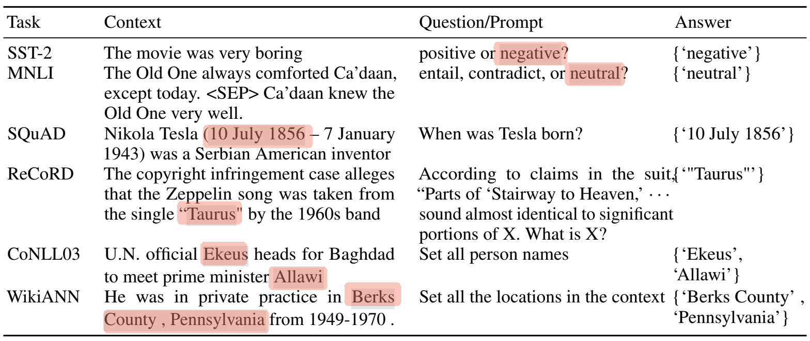

|             |                                    |
| :---------- | :--------------------------------- |
| Paper URL   | https://arxiv.org/abs/2111.02570   |
| Code URL    | https://github.com/microsoft/CLUES |
| Authors     | Subhabrata Mukherjee et al.        |
| Institution | Microsoft Research                 |
| Year        | 2021                               |
| Conference  | NeurIPS 2021                       |

# What did authors try to accomplish?

# What were the key elements of the approach?

$$
 \varphi = 1+\frac{1} {1+\frac{1} {1+\frac{1} {1+\cdots} } }
$$

