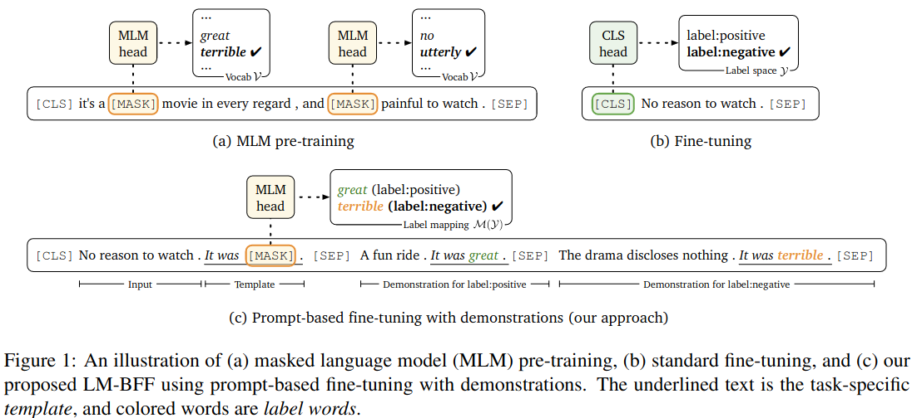

[Paper URL](https://arxiv.org/abs/2111.02570) | [Code and dataset URL](https://github.com/microsoft/CLUES)

Most current benchmarks for natural language understanding (NLU) (e.g. [GLUE](https://aclanthology.org/W18-5446/), [SuperGLUE](https://proceedings.neurips.cc/paper/2019/file/4496bf24afe7fab6f046bf4923da8de6-Paper.pdf)) contain tasks that are easily represented as classification tasks and provide models with large amount of task-specific training data. In these circumstances, when some model exceeds "human-level" performance on these benchmarks, it's not completely comparable to humans who perform these tasks given only a few demonstrations.

To combat this limitation authors seek to provide a standardized evaluation of different few-shot learning approaches and demonstrate a significant gap in the few-shot learning performance between humans and machines for NLU tasks. Their **CLUES benchmark** is intended to evaluate general-purpose models across diverse NLU tasks in few-shot setting.

## Benchmark composition

The CLUES benchmark includes a number of tasks. Each task is a collection that consists of
- a natural language task description;
- training sets of labeled examples for different shots (5 training sets for each of 10, 20, 30 shots);
- a test set (with no separate validation set)

The tasks were selected so they are diverse and there exists **a significant gap between human and machine performance**.
Overview of the tasks can be seen in the table below.


Authors _unify all NLU tasks_ with the single format _{context, question/prompt, answer}_ where the answer is a set of spans that could be potentially empty.

Examples from the dataset for each task are given below. The answer spans are highlighted in red.


## Baseline results

### Evaluation metric

Authors introduce a _unified metric_ which can be used to evaluate all tasks in the benchmark. The metric is, essentially, [F1](https://en.wikipedia.org/wiki/F-score) that is modified to work with potentially empty set of spans.

Formally, given a set of spans for model predictions **p**, and a set of spans for ground truth answers **a** for one instance, the per instance _S1_ is defined as follows:

$$
\text{S1}(\mathbf{p}, \mathbf{a}) = \begin{cases}
    \frac{2.0}{\frac{1}{\text{p}(\mathbf{p}, \mathbf{a})} + \frac{1}{\text{r}(\mathbf{p}, \mathbf{a})}} &\text{if } \mathbf{a} \not = \emptyset, \mathbf{p} \not = \emptyset, \text{p}(\mathbf{p}, \mathbf{a}) \cdot \text{r}(\mathbf{p}, \mathbf{a}) \not = 0, \newline
    1.0 &\text{if } a = \emptyset, p = \emptyset, \newline
    0.0 &\text{otherwise.}
\end{cases}
$$

where

$$
\text{precision } \text{p}(\mathbf{p}, \mathbf{a}) = \sum_i \frac{1(\mathbf{p_i} \in \mathbf{a})}{|\mathbf{p}|},
$$

$$
\text{recall }  \text{r}(\mathbf{p}, \mathbf{a}) = \sum_i \frac{1(\mathbf{p_i} \in \mathbf{a})}{|\mathbf{a}|}.
$$

For a test set consisting of multiple instances, the overall _S1_ score is computed as the average of _S1_ scores of all the instances.

Using this metric authors carefully estimate human performance on the tasks and compare it with a number of fined-tuned pretrained language models (PLM).

### Fine-tuning strategies

#### Classic fine-tuning (FT)

- Input is in the format ```"[CLS] [question] [passage]"```.
- Both task-specific head and weights are updated jointly.
- The training is carried out by maximizing the log-likelihood of the answer span, which is defined as follows

$$
P(i, j) = P_b(i) \cdot P_e(j)
$$

$$
P_b(i) = \frac{\text{exp}(\mathbf{w_b^T h_i})}{\sum_k \text{exp}(\mathbf{w_b^T h_k})},
$$

$$
P_e(j) = \frac{\text{exp}(\mathbf{w_e^T h_i})}{\sum_k \text{exp}(\mathbf{w_e^T h_k})},
$$

$$
\mathbf{h_1}, \mathbf{h_2}, \ldots, \mathbf{h_T} \in \R^d - \text{contextualized token embeddings of the input produced by the PLM.}
$$

#### Prompt-based fine-tuning (PT)

- Due to the gap between pre-training and task objectives, the few-shot setting is challenging for classic fine-tuning (not enough data to learn task-specific head effectively).
- Prompt-based fine-tuning tries to address this gap, by formulating task objective in a format as close to the pretraining objective as possible.
- The illustration of the idea taken from [the original paper](https://aclanthology.org/2021.acl-long.295.pdf) is show below



#### GPT-3 in-context learning (ICL)

- In-context training is introduced by [GPT-family of models](https://arxiv.org/pdf/2005.14165v4.pdf).
- Authors conduct evaluations by directly querying GPT-3 without any parameter update with _k_ labeled examples as demonstrations for each example in the test set.

### Analysis of results


